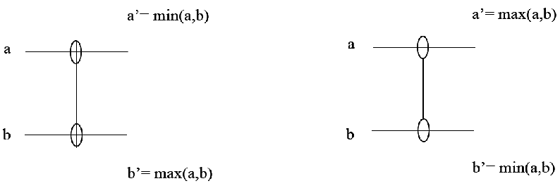
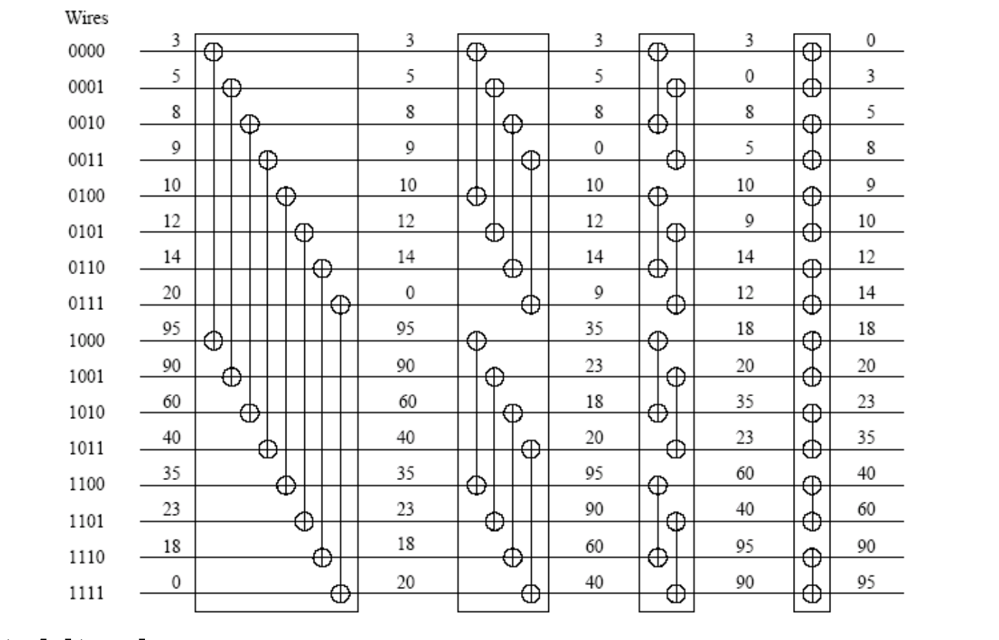
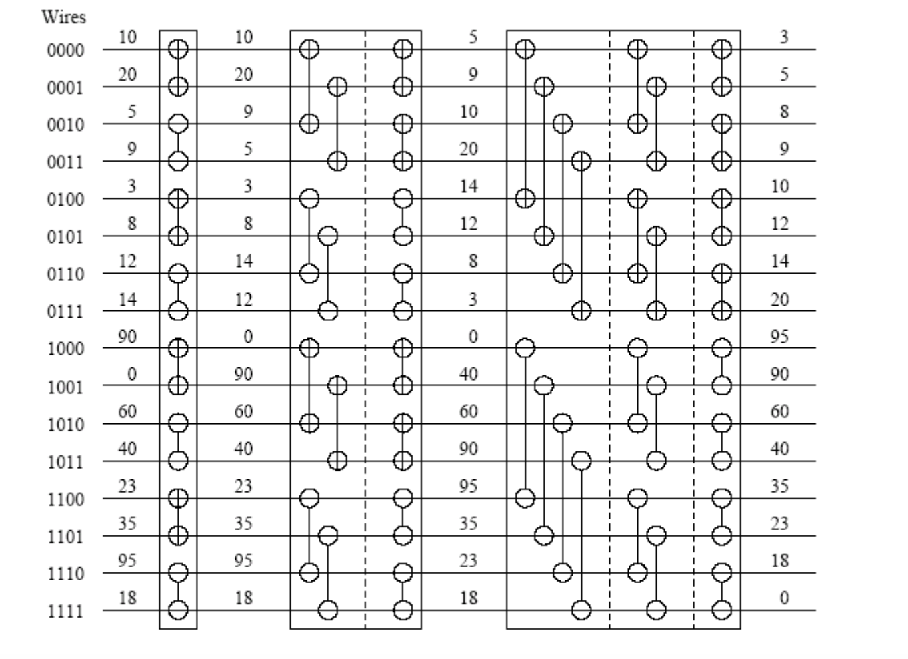
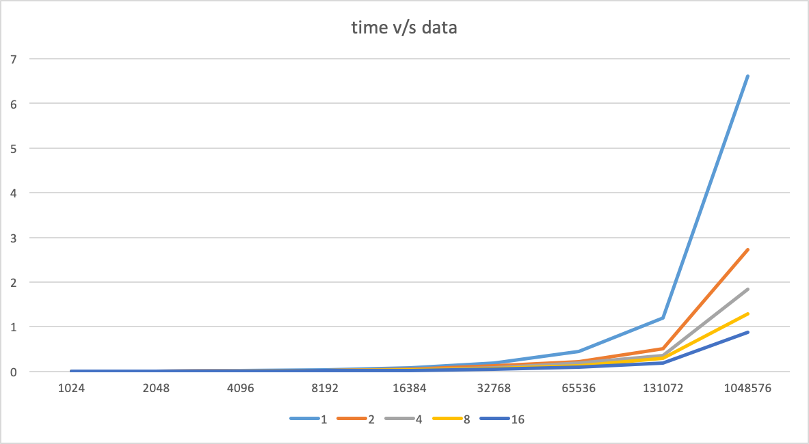
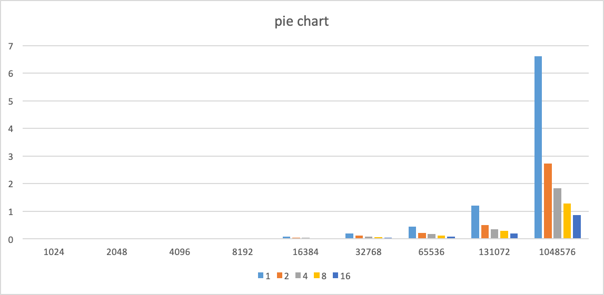

## Bitonic Sort

Before looking at Bitonic sort let us look at 
the comparator circuits which form the basics of
bitonic sort.

In the increasing comparator circuit 
(denoted by +) we provide two numbers. In 
the upper line we get the minimum of
the two numbers as output while in the lower
line we get the maximum number as output.

The decreasing comparator circuit (denoted
by -) provides the reverse output. The
upper line gets the maximum while the 
lower line gets the minimum value.

A bitonic sequence is one which is increasing
and then decreasing for example 2,4,6,8,10,9,7,5,3,1
is a bitonic sequence. Now given a bitonic
sequence it can be easily converted into
a sorted sequence using the increasing
comparator circuit.

Now to convert a given sequence to bitonic
we need the increasing as well as the 
decreasing comparator circuits.

Now we can easily combine the two to get 
a sorted array 

Image reference:
https://wiki.rice.edu/confluence/download/attachments/4435861/comp322-s12-lec28-slides-JMC.pdf

## Implementation
Bitonic sort is implemented using Message 
Passing Interface(MPI) in C.

The first step is generating a bitonic
sequence.

If we closely look at the algorithm
generating the bitonic sequence then we 
can find the pattern. In the first
step each process compares with another
process that differs at the first bit. 
In the second step with the process that differs 
at the second step and so on. This continues 
until the process number reaches log(p) and then
we move back in.

Initially all the elements are distributed  across
the processes using scatter. 
Then to convert it into a bitonic
sequence each process will calculate two things:
1. Index of the next element
2. It is a positive comparator circuit or a negative
comparator circuit

Now there can be three scenarios:
 1. the next element
is present on the same process
 2. the next element is present on a process with rank less than the current
process
3. the next element is present on a process with
rank greater than the current process.

No communication is required for the first scenario,
but data needs to be sent across processors for 
the second and third scenarios. The logic for data 
transfer is first process with the lower rank will
send data and then the process with higher rank will
send data. Blocking send and receive calls are used
for data transfer. Finally the entire array is 
assembled at the process with rank 0 using the 
gather operation.

 

 
## Results

time v/s number of data elements; colors
represent the number of processes

bar chart of time v/s number of data elements; 
colors represent the number of processes

## Running the Program

Prerequisites MPI for C should be configured in the path

To compile the program

 mpicc -o bitonic bitonic.c
  
 Some machines give error for the math library so compile using
 
 mpicc -o bitonic bitonic.c -lm

To run the program 

mpirun -np \<number of processes> ./bitonic \<size of data>  \<1 or 2>

where \<number of processes> is the number of processes to be created

\<size of data> is the size of the array to be generated

<1 or 2> if 1 then the process will print the sorted array, if 2 will not print
Both the number of processes and the size of data should be a power of 2 else the program will fail

e.g. 

mpirun -np 16 ./bitonic 1048576 2
 
mpirun -np 8 ./bitonic 1024 2