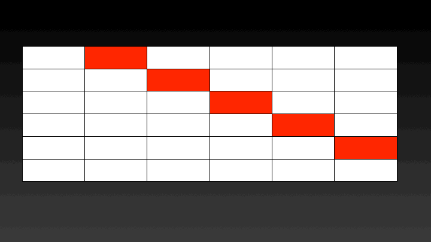

#Optimal Binary Search Trees
In this problem given a set of keys and their access frequencies, we have
to construct a BST such that the least overall access time is achieved. For
example suppose we have two keys [10,15] with frequencies as [10,30]. 
There can be two BSTs with one 10 as the root and the second with 15.

If we consider the first tree with 10 as the root then the overall
cost = 10 * 1 + 30 * 2 = 70

If we consider the second tree with 20 as the root then overall cost =
10 * 2 + 30 * 1 = 50

Hence the structure of the tree affects the retrieval performance.

## Dynamic Programming Approach
The  naive approach for solving this problem is to create all the 
possible trees and calculate their costs. Then select the tree with the 
minimum cost. This program will have a factorial time complexity and 
the same sub-problems will be recomputed. Hence we attempt to solve this 
program using dynamic programming.

In this approach we create a two dimensional array (cost\[n]\[n]) to store the solutions
of subproblems; cost\[i]\[j] specifies the minimum cost of the binary 
search tree considering the keys i to j. We first calculate the cost 
considering 2 keys, then 3 keys and so on until we cover all the keys. 
Which means we calculate c\[1,2] i.e. the minimum cost considering keys
1 and 2, then c\[2,3] and so on.

We can use the following formula to calculate c\[i,j] where k goes from 
i to j.

 We store the minimum cost for c\[i,j].
 

## Parallelize Solution 
We can easily parallelize this solution using Threading. The cost 
of constructing binary search trees with k keys can be calculated in
parallel. For calculating the cost of a BST with k keys the cost of BSTs
with k-1 keys is required. Hence there is no data dependence.
Which means the cost of BSTs considering 2 keys can be calculated
in parallel, then 3 keys can be calculated and so on. A graphical 
representation of the steps performed in parallel can be seen below.

The catch is that all the threads should have completed calculating the cost
of BSTs with k keys before moving to calculating the cost of BSTs with k+1
keys. To ensure this step this implementation uses a Barrier, which 
will let each thread go ahead once all the threads have reached it.

 

## Running the Program
To run parallel_obst

javac parallel_obst.java,

java parallel_obst \<number of keys> \<number of threads>

example

java parallel_obst 5000 12

5000 - keys, 12- threads

This program requires serial_obst.java as well since after running it in parallel it will run it in serial.
The program will calculate the cost in parallel and then calculate the cost in serial on the same frequencies
To run serial_obst.java

javac serial_obst.java

java serial_obst \<number of keys>

serial_obst will only print the total cost. 
